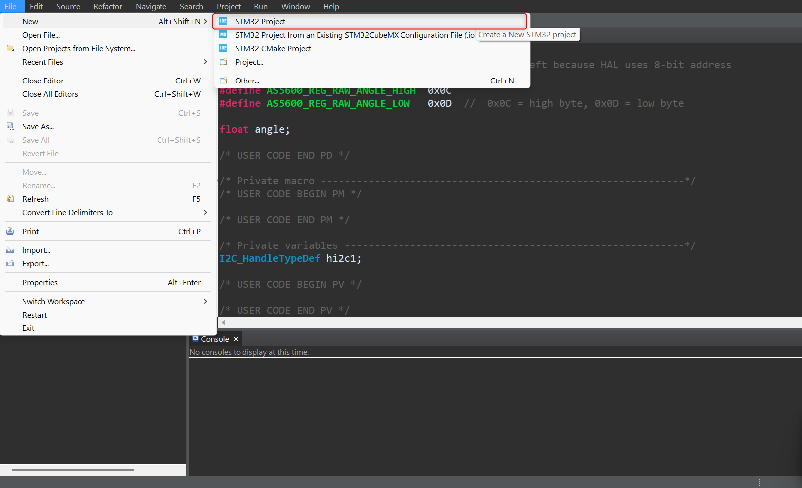
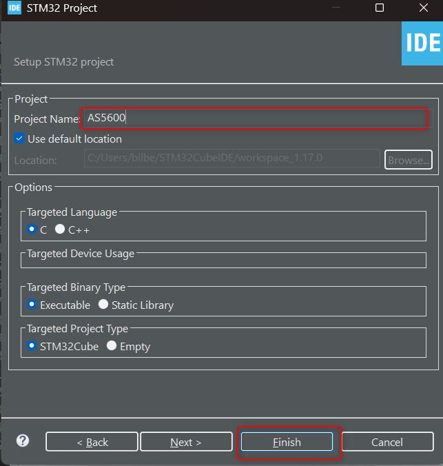
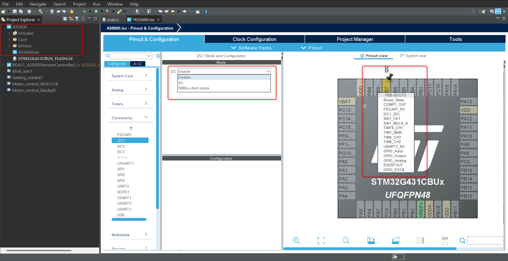

Reading absolute angle using AS5600 and STM32 B-G431_ESC-1

This project uses Hardware Abstraction Layer (HAL) for STM32. You'll need STM32CubeIDE installed for this project.

1. Create a new STM32 project

2. Configure I2C for your corresponding STM32. For my B-G431-ESC1, it is PB7 and PB8 as SDA and SCL correspondingly

3. Click Save and generate code.

You can find your generated code under Core--> Src--> main.c

4. Compare main.c in repo with generated main.c and include missing part until while loop.

Run the code in debug mode and add "angle" into the live expression. You can now find the angle getting updated as the magnet attached your rotary shaft changes/moves.
