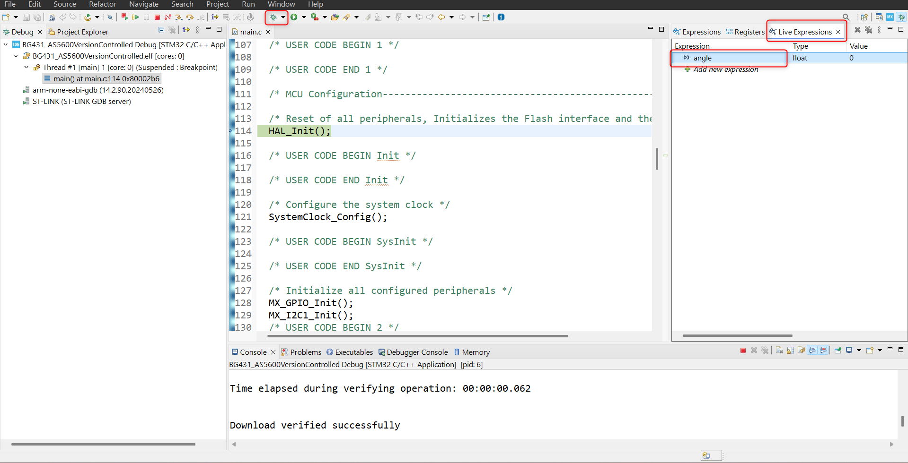
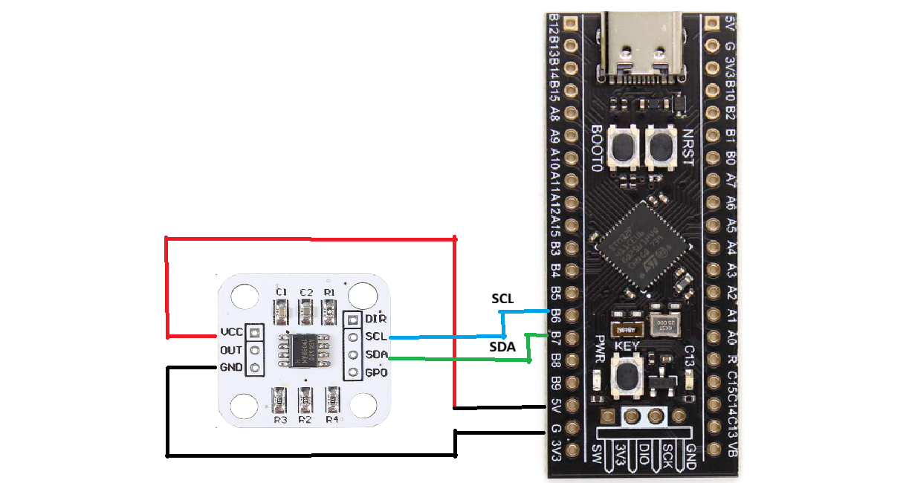

# Reading absolute angle using AS5600 and STM32 B-G431_ESC-1

This is a beginners guide to STM32 and embedded hardware programming. You need a basic understanding of C language. Even if you don't have any coding experience, you can give it a try by following the instructions.

When you're using a STM32 embedded hardware, there are mainly 3 approaches for programming it.
* Bare metal (With or Without CMSIS)
* HAL(Hardware Abstraction Layer)
* RTOS

You can use any common STM32 development boards for beginners (Blue Pill, BlackPill, Discovery etc..). Make sure your board either has a onboard ST-Link debugger or you have to buy it separately. BluePill and BlackPill doesn't have a debugger onboard, but discovery boards usually comes with one.

This project uses Hardware Abstraction Layer (HAL) for STM32. You'll need STM32CubeIDE installed for this project. You can download it from here. https://www.st.com/en/development-tools/stm32cubeide.html

## Create a new STM32 project

Goto the MCU selector and type in your STM32 chip name. You can refer datasheet for you Bluepill or Discovery or look into the specifications in the product page from which you have purchased the board.

Give a project name. Keep all the remaining options the same. Make sure "Targeted Project Type" is "STM32Cube" and Finish the project creation.

## Configure I2C for your corresponding STM32. 
Since we're reading the absolute angle from AS5600 using I2C protocol, we need to configure it in the .ioc file or UI. You board might contain more than one I2C supported ports. Make sure you're configuring the same to which you have connected the wires from the sensor.  

There are 2 steps in configuring I2C. 
* Select the SDA and SCL ports for your I2C. For my STM32(B-G431-ESC1), I2C1 ports are PB7 is SDA and PB8 is SCL.
* Enable the I2C, for me - Goto Connectivity --> I2C1 --> Move from Disable to I2C  

You have just configured the I2C. __We just configured these in the UI because the CubeIDE will generate most of the code for us. We only have add our logic or computation on what to do with read value from sensor or how often should the MCU read it or update it.__

## Click Save and generate code.

Click on save under File --> Save or click on the "hammer" icon to generate code. The are a whole bunch of files generated, but the only one we want to modify is main.c which will be popped up automatically. If not you can find your generated code under Core--> Src--> main.c

##   Compare main.c in repo with generated and main.c

The logic to read the values and convert it from binary to decimal is implemented in the repo main.c file. You can include missing part into your generated code. Make sure to do this until the end of while loop. Now run the code in debug mode . If everything in the software part went well, you won't get any errors. You can enter into debug mode by clicking on the bug icon in the taskbar. This will compile and upload the code into the board and the prompt you to switch perspective. Click Switch and add "angle" into the live expression tab and hit enter.

You can now find the angle getting updated in value column as you rotate the magnet attached your rotary shaft.

## Hardware Connections

